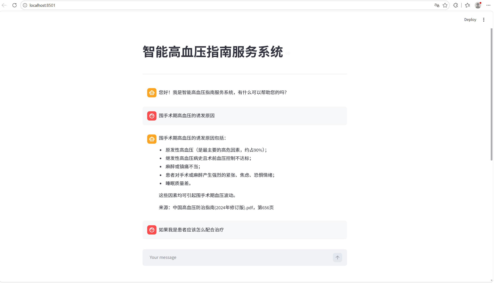
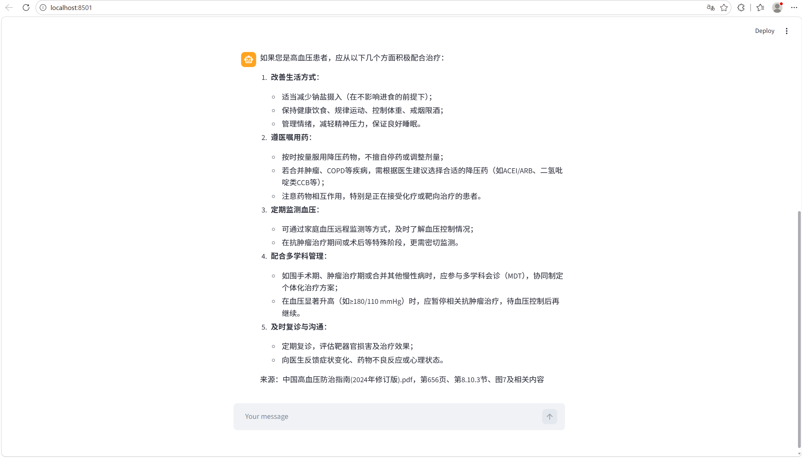

# 智能高血压指南服务系统

## 功能

- 针对**有门槛**的垂直领域，项目利用RAG技术，在检索方面使用了**向量+BM25**的**双重混合检索**，提高AI生成质量

- 严格约束AI生成，与该知识领域**无关**的一切问题AI都不会回复

- 支持**长对话**，保存沟通的上下文信息

- 支持**多用户**

- AI回复**显示来源**，提供参考资料，第几页，第几章

## 演示示例

## 快速开始

- 在app_qa.py的路径终端下输入：`streamlit run app_qa.py`
